```{r setup, include=FALSE, fig.align='center', message=FALSE, echo=FALSE, cache=FALSE}
options(htmltools.dir.version = FALSE)
```
# Sobre mim 

#### Jennifer Luz Lopes

- Engenheira Agrônoma de paixão

- Mestre em Melhoramento Genético de plantas

- Quase doutora na mesma área

- Gaúcha, louca por:

1. **Natureza**
1. **Gatos e cachorros**
1. **Incensos, cristais e meditação**
1. **Pela minha família**
1. **Estudar**
---
# Motivação para usar o R?

```{r message=FALSE, warning=FALSE, , out.width="25%", paged.print=FALSE, echo=FALSE, fig.align = 'center'}
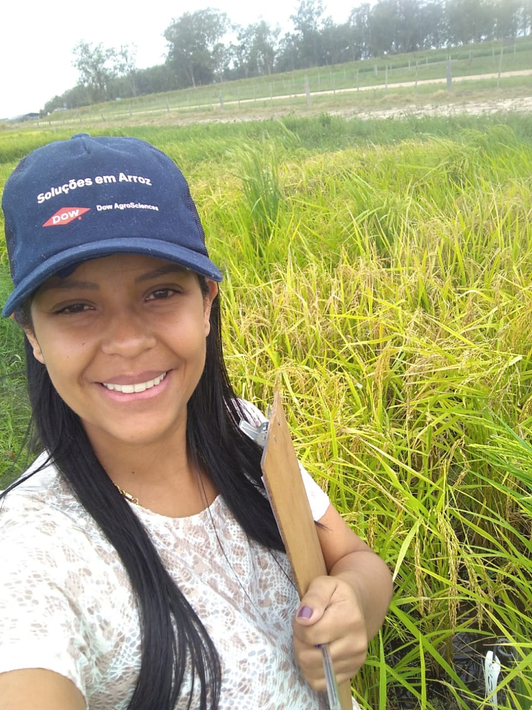
```

```{r message=FALSE, warning=FALSE, , out.width="25%", paged.print=FALSE, echo=FALSE, fig.align = 'center'}
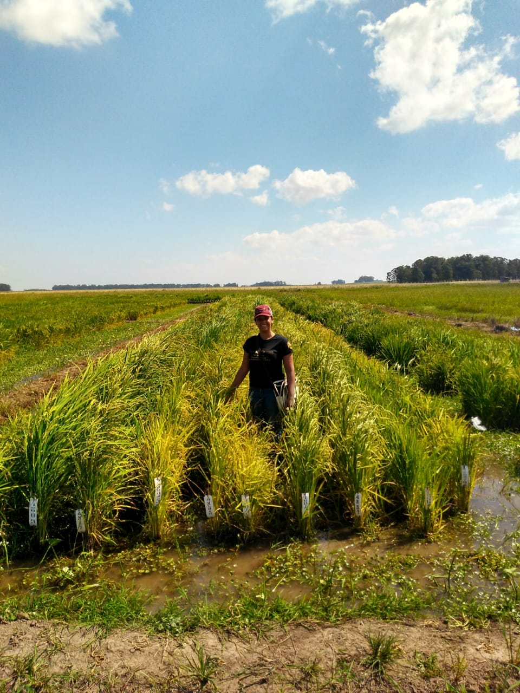
```

---
# Sobre a R-Ladies

```{r message=FALSE, warning=FALSE, , out.width="100%", paged.print=FALSE, echo=FALSE, fig.align = 'center'}
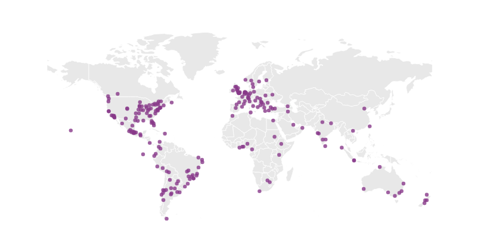
```

R-Ladies é uma organização mundial cuja missão é promover a diversidade de gênero na comunidade R.
---
# Estamos, somos e realizamos

```{r message=FALSE, warning=FALSE, , out.width="70%", paged.print=FALSE, echo=FALSE, fig.align = 'center'}
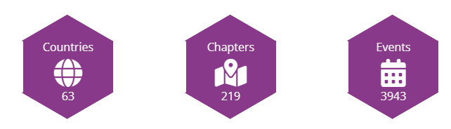
```

.center[]

A R-Ladies Goiânia faz parte desta organização com muito orgulho!
---

# Missão

A missão do R-Ladies é alcançar uma representação proporcional ao encorajar, inspirar e capacitar pessoas de gêneros atualmente sub-representados na comunidade R.

# Foco

O foco principal do R-Ladies, portanto, é apoiar entusiastas do gênero de minorias a atingir seu potencial de programação, construindo uma rede global colaborativa de líderes, mentores, alunos e desenvolvedores em R com o objetivo de facilitar o progresso individual e coletivo em todo o mundo.


🟣 Respeito | Inclusão | Diversidade | Ambiente seguro | Colaboração

- A R-Ladies dedica-se a proporcionar uma experiência livre de assédio para todas as pessoas partcicipantes, desta forma, não é tolerada nenhuma forma de assédio.

🟣 [Código de conduta](https://www.rladiesgyn.com/c%C3%B3pia-contato)

---
# Time R-Ladies Goiânia+

```{r message=FALSE, warning=FALSE, , out.width="100%", paged.print=FALSE, echo=FALSE, fig.align = 'center'}
knitr::include_graphics("imagens/imagem_5.jpg")
```
---
# Mídias sociais da R-Ladies Goiânia+ 

- Site:https://www.rladiesgyn.com/ 
- MeetUp:https://www.meetup.com/pt-BR/rladies-goiania/
- Instagram:https://www.instagram.com/rladiesgyn/
- YouTube:https://www.youtube.com/channel/UCvt6lv8yMrBV8YgsAoQykHw
- Twitter:https://twitter.com/rladiesgyn
- Github:https://github.com/R-LadiesGYN/README 
---
# Como será a dinâmica do curso?

- Usaremos o **Posit Cloud**

- Vamos integrar a teoria e a prática

- Após cada tópico explicado farei a seção **Dúvidas**

- Pedimos que deixem os microfones desligados

- Faça seu café, chá, chimarrão (aos gaúchos)

- **Aproveitem o máximo possível, é para vocês!**

```{r message=FALSE, warning=FALSE, , out.width="45%", paged.print=FALSE, echo=FALSE, fig.align = 'center'}
knitr::include_graphics("imagens/gif_3.gif")
```
---
# 10 Motivos para você aprender sobre o R

1. Ciência de dados é uma área interdiciplinar

1. Crescente procura de profissionais com essa habilidade 

1. Open source (free)

1. Comunidade crescente e ativa

1. É utilizado em diferentes setores e mercados de trabalho

1. Produz análise de dados avançadas

1. Visualização de dados de alta qualidade

1. Aplicativo interativo (Shiny)

1. Gera relatórios dinâmicos (Word, Power Point, PDF, HTML ...)

1. Facilidade de colaboração (compartilhamento, GitHub)
---
class: inverse, center, middle
# Cronograma do curso
---
# Bora aprender?

1. Ambientação no RStudio

1. Iniciando com R

1. Projetos, pacotes, operador pipe %>%  

1. Manipulação de dados com pacote {**dplyr**}

1. Visualização de dados com pacote {**ggplot2**}

1. Materiais | Bibliografias | Links

```{r message=FALSE, warning=FALSE, , out.width="35%", paged.print=FALSE, echo=FALSE, fig.align = 'center'}
knitr::include_graphics("imagens/gif_4.gif")
```
---
class: inverse, center, middle
# 1. Ambientação no RStudio
---

# 1.1 R, RStudio, Posit Cloud

- O **R** é um ambiente de software livre e de código aberto amplamente utilizado para análise de dados e estatísticas.[Baixe aqui](https://cloud.r-project.org/)

- O **RStudio**, por outro lado, é uma poderosa **interface de desenvolvimento integrado (IDE)** projetada especificamente para facilitar o uso do R.[Baixe aqui](https://posit.co/download/rstudio-desktop/)

- O **Posit Cloud** é uma plataforma que disponibiliza o ambiente de desenvolvimento RStudio na nuvem. Proporciona acesso conveniente ao RStudio sem a necessidade de instalação local.

### 1.2 Vantagens do Posit Cloud

- **Acesso Remoto:** Trabalhe de qualquer lugar com conexão à internet
- **Colaboração:** Compartilhe projetos e colabore em tempo real
- **Recursos Computacionais:** Ganhe poder de processamento para análises complexas
- **Atualizações Simplificadas:** Sem preocupações com atualizações do software
---

# 1.3 Criando sua conta no posit Cloud

1. Acesse o site [**Posit Cloud**](https://posit.cloud)

2. Crie uma conta ou faça login, caso já tenha uma

3. Ao entrar, você será direcionado ao ambiente RStudio na nuvem

```{r message=FALSE, warning=FALSE, , out.width="100%", paged.print=FALSE, echo=FALSE, fig.align = 'center'}
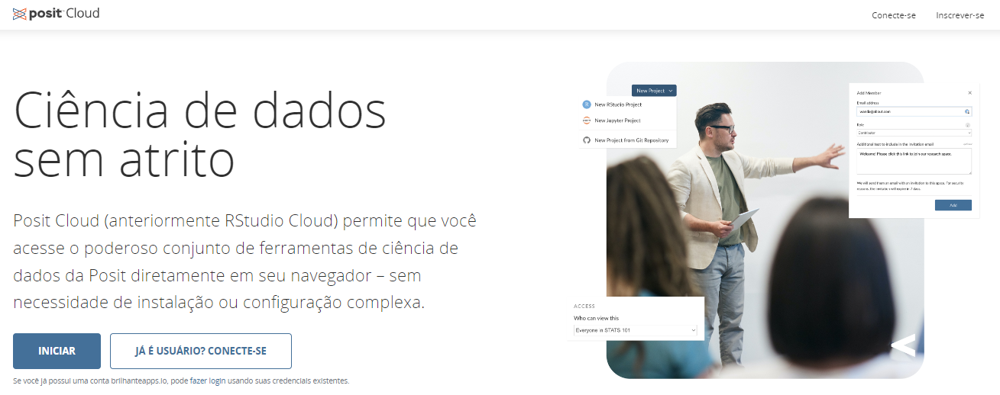
```
---
# 1.4 Meu Projeto

Para que você comece a escrever os códigos ou seja “programar”, é necessário criar um projeto. Veja como abrir clicando em:

**File**> **New_Project**. 

Dentro do projeto você pode abrir um novo script.R, **File**> **New_File**> **R_Script**.

Ou use o atalho **Ctrl + Shift + N**.

[Atalhos|Site da Posit](https://support.posit.co/hc/en-us/articles/200711853-Keyboard-Shortcuts-in-the-RStudio-IDE)

```{r message=FALSE, warning=FALSE, , out.width="60%", paged.print=FALSE, echo=FALSE, fig.align = 'center'}
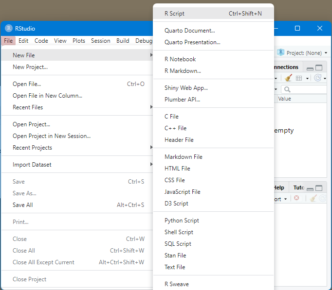
```
---
# 1.5 Ambiente do RStudio
```{r message=FALSE, warning=FALSE, , out.width="80%", paged.print=FALSE, echo=FALSE, fig.align = 'center'}
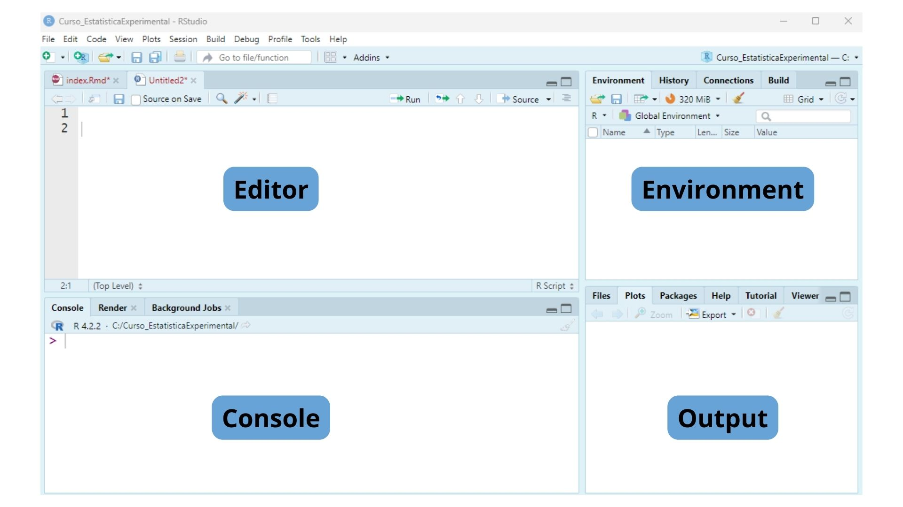
```

- **Editor:** onde você irá escrever e editar os scripts em R

- **Console:** permite a execução dos comandos em R

- **Output (saída):** exibe os resultados das operações realizadas no console

- **Environment (ambiente):** mostra os objetos (variáveis, funções)
---
# Porque o RStudio?
## Ciclo da ciência de dados com R

```{r message=FALSE, warning=FALSE, , out.width="100%", paged.print=FALSE, echo=FALSE, fig.align = 'center'}
knitr::include_graphics("imagens/baseciencia.png")
```

🟣 [Livro R For Data Science](https://r4ds.hadley.nz/intro)

---
class: inverse, center, middle
# 2. Iniciando com R
---
# Começo de tudo, calma que tudo tem jeito!

## "A frustração é natural quando você começa a programar em R, porque é um adesivo para pontuação, e até mesmo um personagem fora do lugar fará com que ele reclame. Mas enquanto você deve esperar ser um pouco frustrado, tenha conforto em que é típico e temporário: acontece com todos, e a única maneira de superar isso é continuar tentando".

### Hadley Wickham & Garrett Grolemund

---
# R como calculadora

```{r}
5/ 200 * 30
```

```{r}
(100 + 25 + 2) / 3
```

```{r}
15 %/% 4 # parte inteira da divisão por 4
```

```{r}
15 %% 4 # resto da divisão por 4
```

### Atalho para execução do código
**Ctrl + Enter**: executa o código selecionado
---
class: inverse, center, middle
# Objetos no R
---

# Objetos

- No contexto do R, uma **variável** como conhecemos é considerada um **objeto**, uma estrutura predefinida que armazena valores. 

- Tecnicamente, um **objeto (ou variável)** é uma alocação de memória onde o R guarda valores ou resultados de comandos, utilizando um nome definido pelo usuário.

```{r}
nome_do_objeto <- 30 + 50 + 80
```

```{r}
y= 20 * 20
head (y)
```

### Atalho para o sinal de atribuição
**Alt + -** (Alt e menos)
---

# Tipo de objetos

```{r message=FALSE, warning=FALSE, , out.width="50%", paged.print=FALSE, echo=FALSE, fig.align = 'center'}
knitr::include_graphics("imagens/tipos de dados.png")
```

### **Vetores**
Eles são conjuntos de elementos do mesmo tipo, como números ou caracteres, armazenados em uma única dimensão. Podemos criar um vetor simples usando a função c(). Formam a base para muitas outras estruturas.

```{r}
vetor1 <- c(10, 20, 30, -50)
```

```{r}
vetor2 <- c("j", "k", "m")
```

**Cada coluna de um data frame será representada como um vetor.**
---

# Tipo de objetos

### **Data Frames**

Os data frames são super importantes no R, pois são os objetos que armazenam nossos dados. Podemos dizer que eles são equivalentes as nossas planilhas do excel, por exemplo.

**A principal caracteristíca deste tipo de objeto é possuir linhas e colunas, lembre! Veja o exemplo abaixo:**

```{r}
data(iris)
head(iris)
```
---

# Tipo de objetos (Tarefa para casa)

### Listas, Matriz e Array 

🟣 [YouTube-R-Ladies Goiânia](https://www.youtube.com/)

```{r message=FALSE, warning=FALSE, , out.width="30%", paged.print=FALSE, echo=FALSE, fig.align = 'center'}

```

```{r message=FALSE, warning=FALSE, , out.width="30%", paged.print=FALSE, echo=FALSE, fig.align = 'center'}

```

---
class: inverse, center, middle
# Pacotes no R 
---
# Pacotes no R 
Pacotes são coleções de **funções** R, dados e código compilado em um formato bem definido.

##### Instalação dos pacotes (usar sempre "nome_do_pacote ")
##### 1. Usar a função install.packages(), via CRAN
```{r}
#install.packages("tidyverse")
```

##### Carregar o pacote toda vez que reiniciar o RStudio
##### Utilizar a função library()
```{r}
#library(tidyverse)
```

```{r message=FALSE, warning=FALSE, , out.width="30%", paged.print=FALSE, echo=FALSE, fig.align = 'center'}
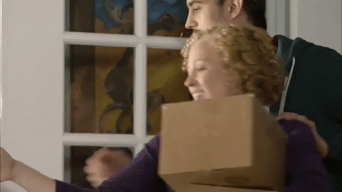
```

---
# Pacotes no R 

##### 2. Instalação via GitHub
```{r}
# install.packages("devtools")
# devtools::install_github('tidyverse/tidyverse')
```

##### Informações sobre o pacote
```{r}
tidyverse::tidyverse_packages()  
```

##### 3. Instalação via Output (Vamos ver na prática).

---
class: inverse, center, middle
#Operador pipe %>%
---
# Operador pipe %>%

- O valor do lado **esquerdo** do pipe vira argumento para a função do lado **direito**.

- **Atalho: Ctrl + SHIFT + M**
```{r message=FALSE, warning=FALSE, , out.width="80%", paged.print=FALSE, echo=FALSE, fig.align = 'center'}
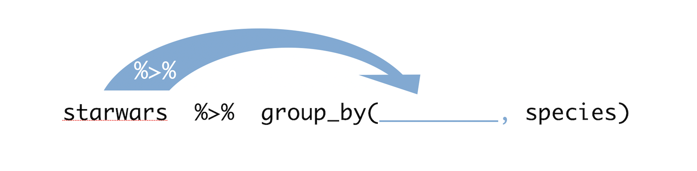
```

```{r include=TRUE, message=FALSE,warning=FALSE}
library(tidyverse) # Carregando os pacotes
library(magrittr)
```

```{r}
iris <- (iris) # Carregando a base de dados
```

```{r echo=TRUE, results='hide'}
iris %>% 
  dplyr::select(Sepal.Length) %>% 
  dplyr::filter(Sepal.Length > 7) %>% 
  dplyr::arrange(desc(Sepal.Length))
```
#### Operador pipe |> 
---
class: inverse, center, middle
# Dicas importantes
---
## Fica de olho!
1. **Objeto**: é onde guardamos os nossos dados.

1. Use nomes fácies para criação de **objetos**,(evite maiuscula,espaço,acento.

1. Erros de digitação e de letras maiúsculas e minúsculas (o R diferencia).

1. Não use as palavras **reservadas** para nomear objetos,(não use números no início do nome de um objeto)

1. **Variável**: é uma coluna da tabela.

1. **Pipe %>%**: A idéia dele é permitir a composição de funções. Ou seja, o resultado/output de uma operação serve de entrada/input para outra operação.

1. **Data frame | Tibble **: significam uma planilha.

1. Use o **TAB** para autocompletar o código.

1. O R é case sensitive.

1. Não esqueça de **carregar os pacotes**, toda vez que abrir o R.
---
class: inverse, center, middle
# Manipulação de dados com pacote {dplyr}

```{r message=FALSE, warning=FALSE, , out.width="60%", paged.print=FALSE, echo=FALSE, fig.align = 'center'}
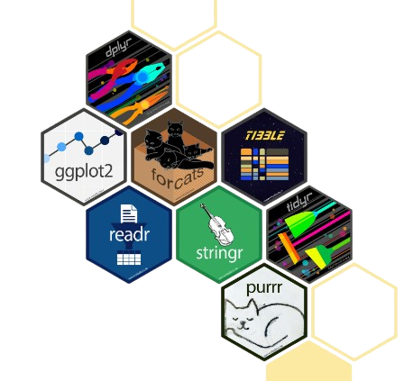
```
---
# Antes disso: Tidyverse

## Pacotes R para ciência de dados

- O **tidyverse** é uma coleção opinativa de pacotes R projetados para ciência de dados. Todos os pacotes compartilham uma filosofia de design, gramática e estruturas de dados subjacentes.

- Você instalando o **tidyverse**, todos os outros pacotes também serão instalados.

- **Pacotes**: dplyr | ggplo2 | forcast | TIBBLE | readr | stringr | tidyr | purrr

🟣 Acesse a documentação: https://www.tidyverse.org/
---
# Pacote dplyr
```{r message=FALSE, warning=FALSE, , out.width="20%", paged.print=FALSE, echo=FALSE, fig.align = 'center'}
knitr::include_graphics("imagens/logo.png")
```

- O pacote **dplyr** é uma gramática de manipulação de dados, fornecendo um conjunto consistente de verbos que ajudam a resolver os desafios mais comuns da manipulação de dados.

- As funções **dplyr** sempre retornam uma cópia transformada da sua tabela. Eles não mudarão sua tabela original, a menos que você solicite (salvando o nome da tabela original). Isso é uma boa notícia, porque você deve sempre manter uma cópia limpa dos seus dados originais, caso algo dê errado.

🟣 Acesse a documentação: https://dplyr.tidyverse.org/
---
# Verbos do dplyr

## As principais funções: 

- **mutate**: cria colunas ou altera valores de uma coluna

- **select**: seleciona variáveis com base em seus nomes

- **filter**:  escolhe casos com base em seus valores

- **summarise**: reduz vários valores a um único resumo

- **arrange**: altera a ordem das linhas

- **group_by**: agrupa linhas de valores iguais em uma coluna

```{r message=FALSE, warning=FALSE, , out.width="35%", paged.print=FALSE, echo=FALSE, fig.align = 'center'}
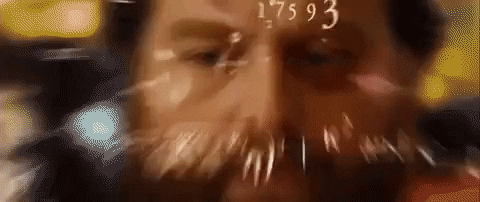
```
---
# Conjunto de dados

Pesquisa Nacional de Exame de Saúde e Nutrição (NHANES) é um programa de estudos desenvolvido para avaliar a saúde e o estado nutricional de adultos e crianças nos Estados Unidos.

```{r message=FALSE, warning=FALSE, , out.width="100%", paged.print=FALSE, echo=FALSE, fig.align = 'center'}
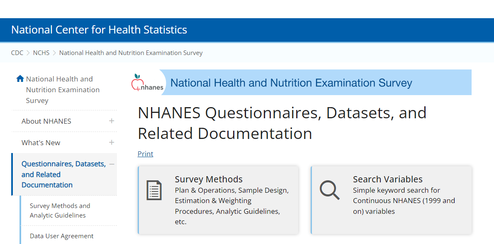
```
---
## Variáveis que vamos manipular
- ID
- ano
- genero
- idade
- idade_dec
- raca
- educacao
- estado-civil
- renda
- trabalho
- peso
- altura
- imc
- saude_genero
- horas_sono
- atividade_fisica
- atividade_diaria
- fumante
---
# Arquivos do projeto que vocês irão utilizar

### curso_introducaoeaplicacaoes.Rproj (Projeto)

### slides_curso.Rmd (Slides RMarkdown)

### Manipulacao.R (Manipulação de dados)

### Visualizacao.R (Visualização de dados)
---
class: inverse, center, middle
# Vamos para prática ?

```{r message=FALSE, warning=FALSE, , out.width="100%", paged.print=FALSE, echo=FALSE, fig.align = 'center'}
knitr::include_graphics("imagens/cat.gif")
```
---
class: inverse, center, middle
# Visualização com  pacote {ggplot}

```{r message=FALSE, warning=FALSE, , out.width="80%", paged.print=FALSE, echo=FALSE, fig.align = 'center'}
knitr::include_graphics("imagens/ggplot.gif")
```
---

# ggplot e sua gramática

```{r message=FALSE, warning=FALSE, , out.width="20%", paged.print=FALSE, echo=FALSE, fig.align = 'center'}
knitr::include_graphics("imagens/ggplot2Hex.jpg")
``` 
- O **ggplot2** é um pacote R para produzir gráficos estatísticos ou de dados. 

- Ao contrário da maioria dos outros pacotes gráficos, o ggplot2 possui uma gramática subjacente, baseado no livro The grammar of graphics (Wilkinson, 2005), que permite compor gráficos combinando componentes independentes.

- A principal referência deste pacote é o livro ggplot2: **Elegant Graphics for Data Analysis (3e)**, escrito por Hadley Wickham. 

🟣 [Use este livro como referência](https://ggplot2-book.org/)
🟣 [Documentação do pacote](https://ggplot2.tidyverse.org/)
---

# Gramática do ggplot

```{r message=FALSE, warning=FALSE, , out.width="100%", paged.print=FALSE, echo=FALSE, fig.align = 'center'}
knitr::include_graphics("imagens/visualizacao.png")
``` 

1. **Obtenção dos dados**

1. **Mapear aesthetic (aestética)**

1. **Escolher a geometric (geometria)**

1. **Escolher o theme (tema)**
---

# Geoms (geometrias)

- As geometrias (geoms) representam os elementos visuais reais do gráfico. 

- O ggplot2 oferece uma variedade de geoms para criar diferentes tipos de gráficos, como:

1. **geom_point():** gráficos de dispersão

2. **geom_line():** gráficos de linhas

3. **geom_bar():** gráficos de barras

4. **geom_boxplot():** gráficos de caixa

5. **geom_histogram():** histogramas

✔️ **Histograma:** utilizado para dados contínuos, em que os intervalos de classe representam a extensão dos dados.


✔️ **Grafico de barras:** á um gráfico de barra é um gráfico de variáveis categóricas ou discretas.
---
# Salvando gráficos

- ggsave(g, filename = "meu gráfico.png")

- ggsave("meu gráfico.png")

- ggsave("meu gráfico.png", width = 8, height = 5, dpi = 600)

## Acesse a documentação do pacote

🟣 [Pacote ggplot2](https://ggplot2.tidyverse.org/)
---
class: inverse, center, middle
# Vamos para prática ?

```{r message=FALSE, warning=FALSE, , out.width="70%", paged.print=FALSE, echo=FALSE, fig.align = 'center'}
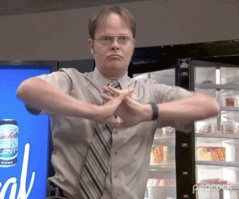
``` 
---
# Materiais

- [Pacote tidyverse](https://github.com/tidyverse)
- [Pacote ggplot](https://github.com/tidyverse/ggplot2)
- [Pacote readr](https://github.com/tidyverse/readr)
- [Pacote dplyr](https://github.com/tidyverse/dplyr)
- [Pacote janitor](https://cran.r-project.org/web/packages/janitor/index.html)
- [Pacote DT](https://rstudio.github.io/DT/)
- [Site da posit](https://posit.co/)
- [Baixar o R](https://cloud.r-project.org/)
- [Baixar o RStudio](https://posit.co/download/rstudio-desktop/)
- [Livro R For Data Science](https://r4ds.hadley.nz/intro)
- [ggplot2: Elegant Graphics for Data Analysis (3e)](https://ggplot2-book.org/)


---
# Muito obrigada

```{r message=FALSE, warning=FALSE, , out.width="85%", paged.print=FALSE, echo=FALSE, fig.align = 'center'}
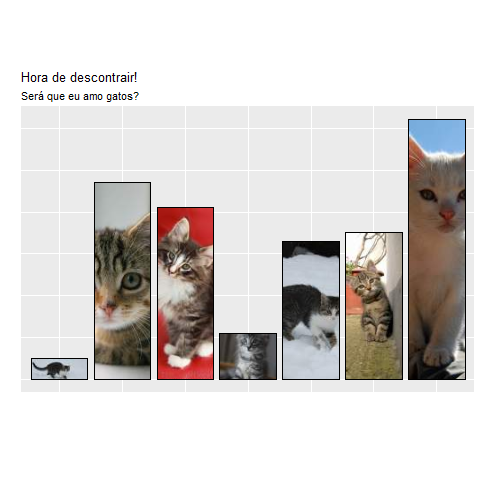
``` 


